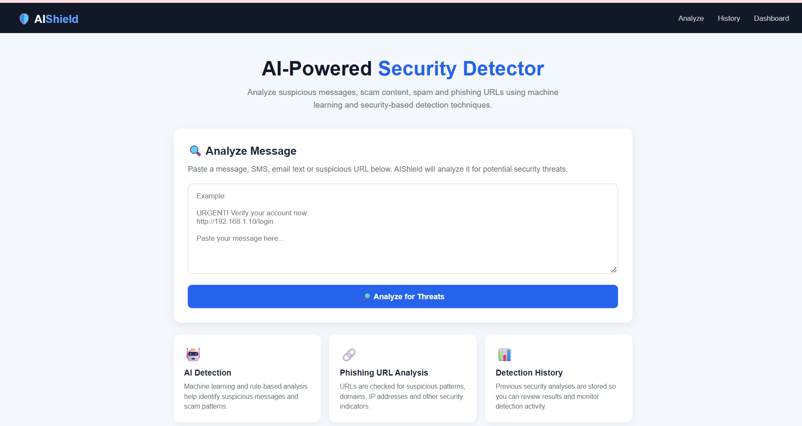
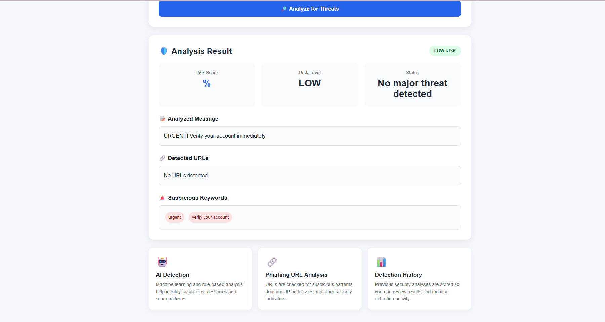
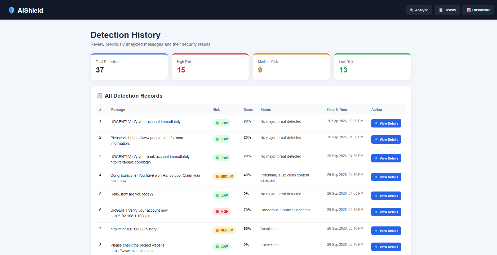
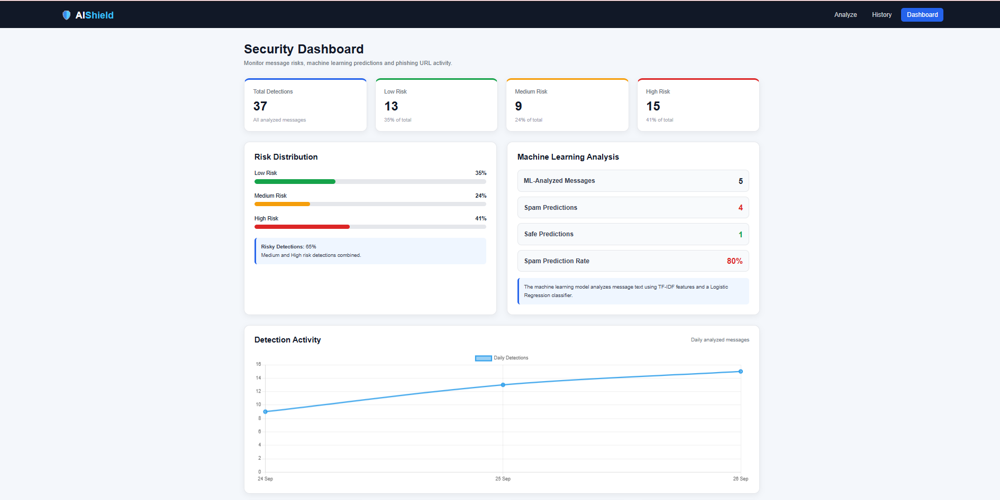

# 🛡️ AIShield – AI-Powered Threat Detection System

AIShield is an AI-powered cybersecurity web application designed to detect and analyze potentially malicious URLs and security threats.

It provides users with a simple interface to scan URLs, view risk scores, check detection history, and monitor security activity through a dashboard.

---

## 🚀 Features

- 🔍 **URL Threat Detection**
- 🤖 **AI/ML-Based Analysis**
- 🛡️ **Risk Score Calculation**
- 📊 **Security Dashboard**
- 📋 **Detection History**
- ⚡ **Fast URL Analysis**
- 🎨 **Modern Responsive Interface**
- 🔐 **Cybersecurity-Focused Design**

---

## 🧠 Risk Scoring

AIShield analyzes submitted URLs and generates a security risk score.

The system categorizes URLs based on their detected risk level:

| Risk Level | Description |
|------------|-------------|
| 🟢 Low Risk | URL appears safe |
| 🟡 Medium Risk | URL contains suspicious characteristics |
| 🔴 High Risk | URL is potentially malicious |

The risk score helps users quickly understand the potential security level of a URL.

---

## 📸 Screenshots

### 🏠 Home Page



### 🔍 Detection Result



### 📋 Detection History



### 📊 Security Dashboard



---

## 🛠️ Technologies Used

- Python
- Django
- HTML5
- CSS3
- JavaScript
- Machine Learning
- SQLite
- Bootstrap

---

## 📂 Project Structure

```text
AIShield/
│
├── screenshots/
│   ├── home.png
│   ├── detection-result.png
│   ├── history.png
│   └── dashboard.png
│
├── manage.py
├── requirements.txt
├── README.md
│
├── static/
├── templates/
│
└── ...
